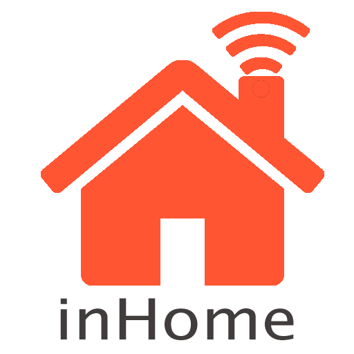

<h1 align="center">
    
</h1>

<h2 align="center">
  🚀 inHome - Inteligência Artificial 🚀
</h2>

  <a href="#rocket-tecnologias">Tecnologias</a>&nbsp;&nbsp;&nbsp;|&nbsp;&nbsp;&nbsp;
  <a href="#-projeto">Projeto</a>&nbsp;&nbsp;&nbsp;|&nbsp;&nbsp;&nbsp;
  <a href="#-layout">Layout</a>&nbsp;&nbsp;&nbsp;|&nbsp;&nbsp;&nbsp;
  <a href="#-como-contribuir">Como contribuir</a>&nbsp;&nbsp;&nbsp;|&nbsp;&nbsp;&nbsp;
  <a href="#memo-licença">Licença</a>

 

## :rocket: Tecnologias

Esse projeto foi desenvolvido com as seguintes tecnologias:

- [Python](www.python.org)
- [TensorFlow](www.tensorflow.org)
- [Pytorch](pytorch.org )

Extras:

- Frameworks/Libs
  - [Flask](flask.palletsprojects.com)
  - [Gunicorn](gunicorn.org)

## 💻 Projeto

**inHome** é um projeto que permite aos usuários controlar equipamentos de conforto térmico via Internet das Coisas. Você pode usar seu computador, smartphone, TV ou qualquer outro dispositivo que tenha conexão com a Internet para controlar seu equipamento.

## 🤔 Como contribuir

- Faça um fork desse repositório;
- Cria uma branch com a sua feature: `git checkout -b minha-feature`;
- Faça commit das suas alterações: `git commit -m 'feat: Minha nova feature'`;
- Faça push para a sua branch: `git push origin minha-feature`.

Depois que o merge da sua pull request for feito, você pode deletar a sua branch.

## :memo: Licença

Esse projeto está sob a licença MIT. Veja o arquivo [LICENSE](LICENSE.md) para mais detalhes.

---

Feito com ❤️ by [**Elismar13**](www.github.com/Elismar13)
